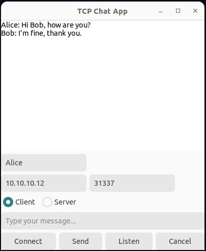
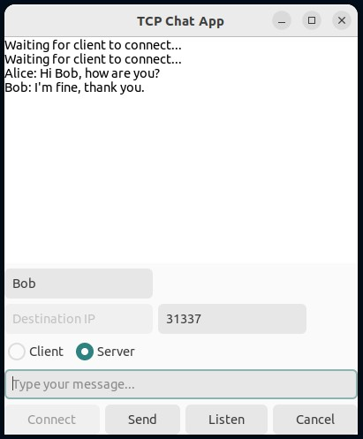

# GTK P2P Chat App

A lightweight peer-to-peer TCP chat application with a clean GTK GUI. This tool lets you chat between two machines using raw TCP sockets — making it useful for simple communication and testing port forwarding or NAT/firewall setups. It can run in either **Client** or **Server** mode from the same binary.

---

## 🖼️ Screenshots

**Client Side (Alice):**  


**Server Side (Bob):**  


---

## ✨ Features

- GTK 4 graphical user interface  
- One binary runs as either a TCP server or client  
- Real-time text-based messaging  
- Custom port and destination IP input  
- Send messages by clicking or pressing Enter  
- Use it to test port forwarding or firewall rules across routers/NATs  

---

## 🛠 Requirements

### OS Compatibility

- ✅ Ubuntu 22.04 or newer  
- ✅ Debian 12, Fedora, Arch, etc.  
- ❌ Not currently tested on Windows or macOS  

### Dependencies

Install the required development packages:

#### On Ubuntu/Debian:
```bash
sudo apt update
sudo apt install build-essential libgtk-4-dev libglib2.0-dev
```

#### On Fedora:
```bash
sudo dnf install gcc gtk4-devel glib2-devel
```

#### On Arch:
```bash
sudo pacman -S base-devel gtk4 glib2
```

---

## ⚙️ Building the App

Clone this repository.

Compile the code with the following command:

```bash
gcc `pkg-config --cflags gtk4` -o chat_app chat_app.c `pkg-config --libs gtk4` -pthread
```

This will generate an executable called `chat_app`.

---

## 🚀 Running the App

```bash
./chat_app
```

The app will launch a GTK window where you can:

- Enter your name  
- Select Client or Server mode  
- Specify the destination IP and port  
- Type and send messages in real-time  

Press **Enter** or click **Send** to transmit a message.

---

## 🔌 Port Forwarding Test (How-To)

This app is perfect for testing if your router and firewall rules are allowing inbound TCP connections.

### Step-by-step example:

#### On Machine A (Server):

- Launch the app: `./chat_app`  
- Set your name  
- Switch to Server Mode  
- Enter a port number (e.g., 31337)  
- Click Listen  
- Set up your router to port forward TCP port 31337 to Machine A's internal IP (e.g., 192.168.1.100)

#### On Machine B (Client):

- Connect to a different network (e.g., mobile hotspot)  
- Launch the app: `./chat_app`  
- Set your name  
- Switch to Client Mode  
- Enter the public IP of Machine A and port 31337  
- Click Connect

If port forwarding is set up properly, the chat connection will be established and you’ll be able to chat between the two machines.

💡 Tip: You can find your public IP using https://whatismyipaddress.com/

---

## ⚠️ Notes

- Not encrypted — don’t use on untrusted networks  
- One connection at a time  
- Meant for testing, learning, and hobbyist experimentation  
- Use a VPN or SSH tunnel if encryption is needed  

---

## 🧼 Clean Up

To remove the binary:

```bash
rm chat_app
```

---

## 📜 License

MIT License. Free to use, modify, and share. Contributions welcome.

---

## 🙌 Author Notes

This was built for personal use to quickly verify network paths and NAT configs.  
It's a great way to visually confirm whether your port forwarding and firewall settings are working as expected — with a little extra fun of sending messages across your local or remote networks.
